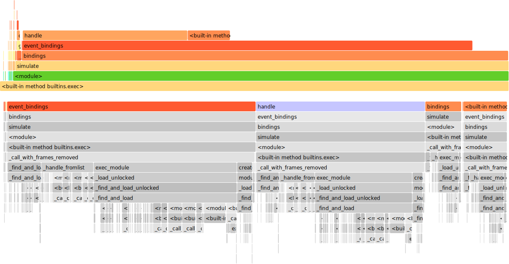
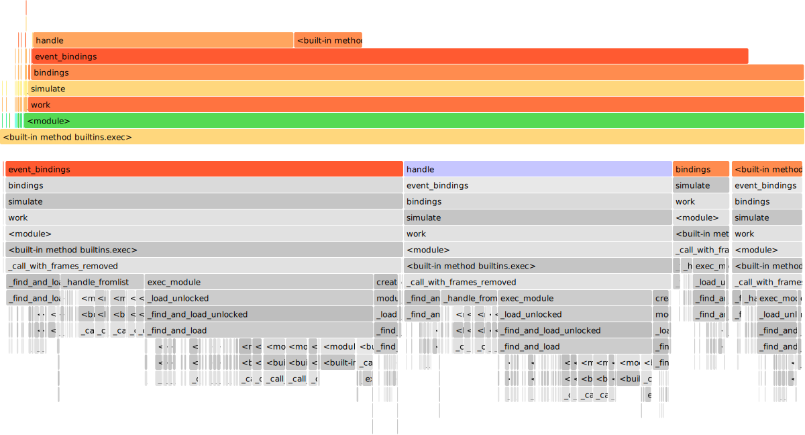
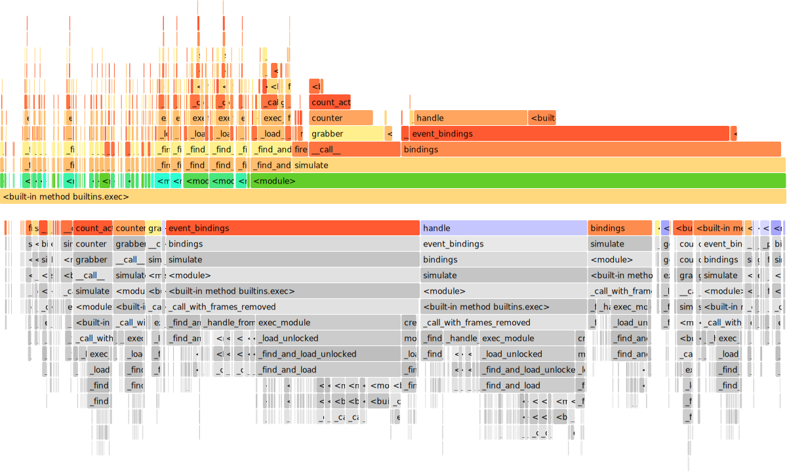
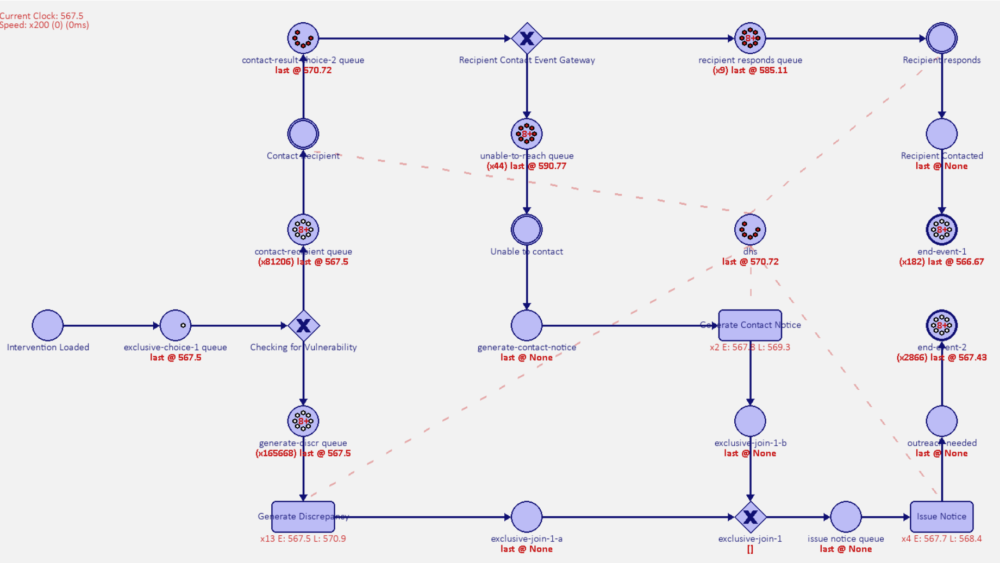
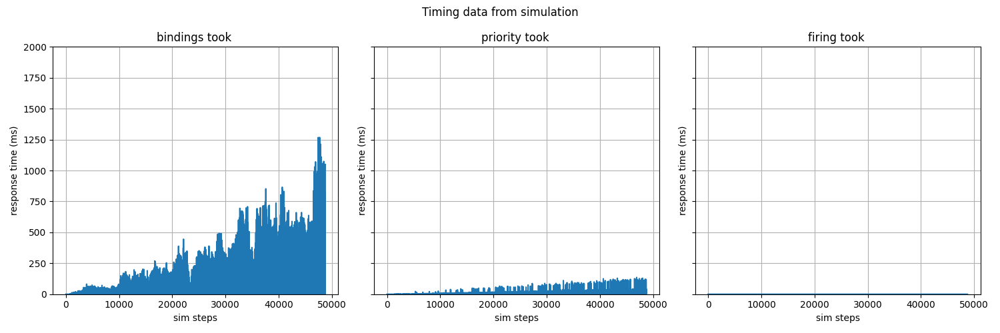
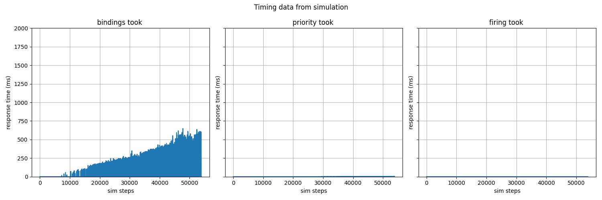
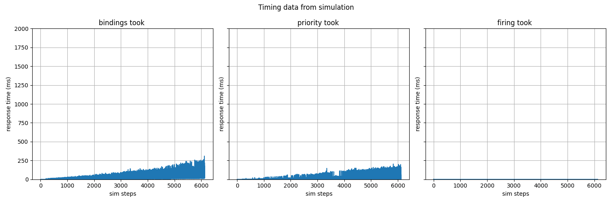
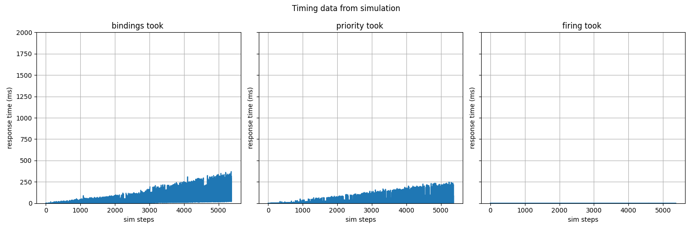

# Simulating the Scheme

This repo captures my initial testing of 
[simpn](https://github.com/bpogroup/simpn) for the purposes of 
simulating a process modelled in BPMN.

Unfortunately, there is not a way to import a `.bpmn` file and get out
a simulation file out of the box, yet...

## Goals

- Simulate the two iterations of the scheme
    - pre-scheme
    - oci 
- Work out a way to make the resulting simulation data presentable via 
  a web interface 
- Work out a way to give power to a visitor to change the process and see
  how these changes affected the performance of the process

## Progress 

Good progress on simulating the pre-scheme process. 
Documentation of examples in simpn is a bit light. 
But mostly reading the code, mostly explains the code. 
More type hints would be nicer for building custom elements.
The interaction of simtokens and simvars still feels a bit foreign to me.

### Initial Thoughts on simPN

Very cool library. The team over at TU/e and Prof. Remco Dijkman have made
something that could be used for the simulation of basically anything.

For my personal peference, it initially felt like I was always writing the
plumbing for my modeling rather than declaratively denoting the steps. So
I made some helper classes in [bpmn.py](./bpmn.py) to make my life a bit 
easier. I took these a step further and have a single wrapper class
by introducing a type name which routes to correct helper classes, these
in turn are wrappers around the `simpn.prototypes` related to BPMN.

### Aesthetics

When working with the initial examples from simpn, I found myself fighting
with the plumbing of setting up a simulation. Perphas there was also a large
amount of my personal perferences for functional or declarative paradigms 
influencing these statements as well, but I wanted to simplify 
writing/reading simulations.

An example of an as-is set of instructions to make a simulation for a single
task consists of the following

```python
...
problem = SimProblem()

p1 = problem.add_place("p1")
p2 = problem.add_place("p2")
r = problem.add_place("resources")
for i in range(3):
    r.put(f"resource-{i+1}")
...
def behaviour(c,r):
    return [
        SimToken((c,r), delay=uniform(1,4))
    ]
task = BPMNTask(
    problem,
    [p1,r],
    [p2,r],
    "Task A",
    behaviour
)
...
```
See [`aesthetics-a.py`](./aesthetics-a.py) for the complete example.

I did not like that I had to instantiate the class and would never afterwards
use the instances. Seems a bit pointless and annoying. Similarly, it would be
nice to reuse the name `behaviour` for bpmn-tasks to keep the cognitive load
lower for reading a sim file. Noting that there are other similar names for 
splits and events that would be nice to keep. 
So I made a bunch of helper classes that shortcuted the work to instaniate 
the classes from `simpn.prototypes` for bpmn elements. An example of one of
these from [`bpmn.py`](./bpmn.py) is shown below.

```python
...
class Start(BPMN):
    type="start"
    model=prob
    name="Started"
    outgoing=["p1"]

    def interarrival_time():
        return pick_time(3)
    
class Resources(BPMN):
    type="resource-pool"
    model=prob 
    name="resources"
    amount=5

class Task(BPMN):
    type="task"
    model=prob
    name="task-1"
    incoming=["p1", "resources"]
    outgoing=["p2", "resources"]

    def behaviour(c, r):
        return [ SimToken((c,r), delay=pick_time(5)) ]
...
```
See [`aesthetics-b.py`](./aesthetics-b.py) for the full example, showing 
all the helpers in action.

By tapping into the `__init_subclass__` hook on the data model for classes 
in python we can write a shortcut to handle creating the class for us. 
As well as checking for the needed attributes on the subclass. 
But, is there any real difference in terms of lines of code? Not really, 
but it does mean for all tasks I define `behaviour` and always using that name. 
Which makes it a bit simplier to remember when making the simulation and 
for when I start making code-snippets. To avoid typos, I have added type 
hints to avoid messing up the `type` of these classes, which is used to 
handle the routing towards the wanted helper class. Likewise, now I just 
say a place name and the help handles the lookup and creation. 
But, does introduce a chance that you include a typo, but you 
can still just drop in a known `SimVar` value instead of a string.

Another aesthetics touch I have been playing around with the actual 
visualisation as well. Notably, I have been building a mirror of the default
pygame interface in [`visualisation.py`](./visualisation.py). See below for
a demonstration. Mostly focusing on showing tokens without text and adding
a "speed up" functionality for the simulation between draw calls.


### Blockers

Performance for my simulations with lots of tokens is not particularly 
good so aiming for simulating one million tokens might be far off. 
Unfortunately, my attempts with `joblib` were not meet with any gains. 
There does seem to be safe inherent parallism but GIL prevents me from 
grabbing any of it. Some minor changes to avoid `list.append`
of a speed of 1.2~1.5 though.

For this testing I was simulating up to a duration of 5 on tut-bpmn-02.py.

Previous state:
times: `(14,10,11,10,11)` = avg of `11.2`


Current state:
times: `(9+9+8.8+9.6+9)` = avg of `9.08`
speed up: `11.2/9.08` = `1.2`


#### Further steps

I looked into making the `SimProblem` always knows when the next 
step should be. By having tracker on tokens and their times, I could 
remove the following block from bindings, which is searching for the 
`min_enabling_time`:
```python
timed_bindings = []
min_enabling_time = None

for t in self.events:
    for (binding, time) in self.event_bindings(t):
        if (time <= self.clock):
            timed_bindings.append((binding, time, t))
        if min_enabling_time is None or time < min_enabling_time:
            min_enabling_time = time
```
I considered replacing it with something like this and only doing the second loop
within `event_bindings`. Perphas moving/droppping the complexity to O(n) vs
O(2n). Though keeping track of `min` and maybe the `max` will likely involve
some sorting algo...or maybe a binary search tree or use `heapq` in stdlib.
```python
if self.enabling_step_back_needed():
  self.clock = self.min_enabling_step()
timed_bindings = [] 
for t in self.events:
    for (binding, time) in self.event_bindings(t):
        if (time <= self.clock):
            timed_bindings.append((binding, time, t))
```
Turns out that a sorted collection from `sortedcollections`
is being used at the lower SimVar level. This means that we can always
quickly grab the smallest/largest time related to tokens. 
So, I ended up writing the following to replace the first loop:
```python
min_enabling_time = None

# find the smallest largest enabling time for an event's
# incoming markings
for ev in self.events:
    smallest = []
    skip = False
    added = False

    for place in ev.incoming:
        try:
            smallest.append(place.marking[0].time)
            added = True
        except:
            skip = True
    
    if (skip or not added):
        continue

    smallest_largest = max(smallest)

    if (smallest_largest == 0):
        continue
    
    # keep track of the smallest next possible clock
    if (smallest_largest is not None) and \
       (min_enabling_time is None or smallest_largest < min_enabling_time):
        min_enabling_time = smallest_largest 
```
As we need only find the largest non-zero smallest token time for each 
event's incoming places. The above code simply access each event's marking,
attempt to grab the first element. Events without a token in each an incoming
place are not included.

Testing consisted of running tut-bpmn-02.py for a duration of 8 with 25 
agents. 8 was selected as it represents the number of business hours in a day.

simpn.simulator.SimProblem:- `86+85+84.5+84.5+82.4 = 422.4` or `84.48` on avg.

util.ParallelSimProblem:- `43.1+42.7+45.9+44.5+45.2 = 221.4` or `44.28` on avg

Speed up:- `84.48/44.28 = 1.91`. Nice close to the 2.0 to be expected from 
dropping the major iteration of `event_bindings`.

Let's check the flame graph after the changes to see what has changed in 
terms of runtime spent by the simulation.

first phase:

second phase:


The last thing to check is if we reduce the number of calls to 
`event_bindings` as both flame graphs note that this function makes up
most of the runtime. Which seems possible now by simply not calling it 
on events that do not have a chance to produce bindings with an 
enabling time less than the adjusted clock.

Rerunning times and the new speed up is:

util.ParallelSimProblem:- `0.4+0.4+0.4+0.4+0.4 = 2` or `0.4` on avg.

Speed up:- `84.48/0.4= 211.2`.

The second phase mostly generates tokens that are delayed for up to 
two weeks at the start, so there is not a lot of "work" for the sim.
So a speed of `211.2` is not a great representation of the improvements.
Instead let's compare with the first phase from now on.

simpn.simulator.SimProblem:- `91.6+89.4+90.5+90.2+89.4 = 451.1` or `90.22` on avg.

util.ParallelSimProblem:- `2.6+2.4+2.4+2.4+2.3 = 12.1` or `2.42` on avg

Speed up:- `90.22/2.42 = 37.28`. Still a pretty crazy speed up from being
far more aggressive with the pruning of bindings. Let's also recompute the
flamegraph as well.



`bindings` is now no longer consuming all the runtime of the simulation,
which is a good sign and maybe I could consider other parts of the workflow. 
But, realistically, I think it would only introduce unwanted complexity.

I attempted to simulate one quarter of the 1,000,000 cases overnight, where
the simulation completed  489.0/567.5 [10:44:43<8:26:20, 386.81s/it] over
roughly 11 hours. Perphas a way to improve performance lies in the way, I am
handling the interarrival rate for the simulations. If were to batch the 
arrival of new cases, the number of calls to bindings would likely be reduced
as well.

Batching the start event will make the start of the simulation faster, but
the runtime benefits will plateu as the tokens lay waiting for the limited
resources to be fired. Where `event_bindings` is computing a cartisan product.

util.ParallelSimProblem:- `1.7+1.7+1.8+1.7+1.8 = 8.7` or `1.74` on avg

Speed up:- `90.22/1.74 = 51.85`. A good boost to the initial setup. I will
revisit speed between this apporach and the last once a 1/4 of the duration 
has been completed.

#### Test run with batching

So the results from running the simulation for a duration of 567.5, without
batching are as follows:
```
Simulating...: 100%|██████▉| 567.4/567.5 [15:49:19<00:13, 214.14s/it]
simulation took 56959.278 seconds...
```
Final State:


The results from running the simulation for a duration of 567.5, with 
batching are as follows:
```
Simulating...: 100%|████████| 567.5/567.5 [16:45:29<-1:59:58, 106.30s/it]
simulation took 60329.116 seconds..
```


#### Checking on response times 

Some general observations of response times from the internal steps of the 
`SimProblem` to progress a step, taken by showing the visualisation and
running the simulation for a couple of minutes.








## Simulation of the Scheme

This section outlines the work to simulate the BPMN 2.0 models derived
for the scheme<sup><a href="#ref1">1</a></sup>, which had a backlog of 
roughly 1,000,000 cases per year. 
Assuming that the agents of DHS were salaried, then the amount of business
hours one could expect from a single agent in a year could be estimated as
`2270` hours<sup><a href="#ref2">2</a></sup>. The arrival rate will then be
business hours in a year divided by cases for the simulations, or a new case 
every `8.172` seconds.

### Pre-Scheme

I have been playing around with the initial phase of the pre-scheme process. 
The sim file for this initial phase `outreach` is 
[tut-bpmn-01.py](./tut-bpmn-01.py).
It was a bit annoying to made with the default simpn patterns, but completely
possible.


Played around with modeling the second phase was optional and called
`extended outreach`, I found I was still playing around plumbing for simvars.
I think adding a way to say a var and it being made for me would be helpful.
The sim file for the `extended outreach` phase is 
[tut-bpmn-02.py](./tut-bpmn-02.py)


The third phase modelled for this iteration of the scheme was `confirmation`.
After making some code snippets to generate the boilerplates for the main 
helper class, I felt like I was just focusing on the modelling. The sim file
for this phase is [tut-bpmn-03.py](./tut-bpmn-03.py).


The fourth phase was for this iteration of the scheme was optional and 
called `third-party collection`. The snippets really felt good...this seems 
like a slippery slope to go down. The sim file for this phase can be found in
[tut-bpmn-04.py](./tut-bpmn-04.py).


The fifth phase for this iteration of the scheme was `entitlement assessment`.
The sim file for this phase can be found in [tut-bpmn-05.py](./tut-bpmn-05.py).


### OCI

No modeling at the moment.

### References
<ol>
  <li id="ref1">
    Adam Banham, Azumah Mamudu, Rehan Syed. <i>A Case for Public Process 
    Documentation: Robodebt an Automated Decision Making System</i>. 
    23rd International Conference on Business Process Management, 
    BPM Forum, 2025 (BPM 2025).
    https://adambanham.io/papers/2025/BPM_2025_Forum__A_Case_for_Public_Proces_Documentation.pdf 
  </li>
  <li id="ref2">
    https://kangarooedu.au/blogs/how-many-working-hours-in-a-year/
  </li>
</ol>
