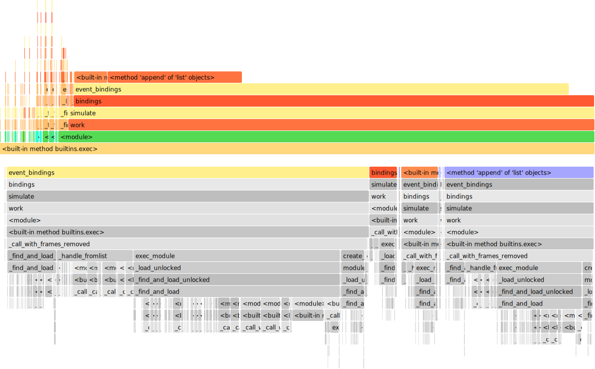
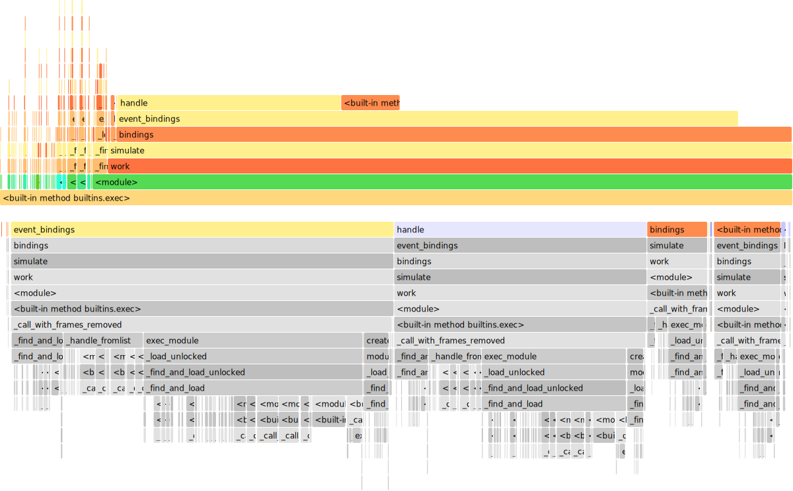

# Simulating the Scheme

This repo captures my initial testing of [simpn](https://github.com/bpogroup/simpn) for the purposes of 
simulating a process modelled in BPMN.

## Goals

- Simulate the two phases of the process
    - pre-robodebt
    - oci 
- Work out a way to make the resulting simulation data presentable via 
  a web interface 
- Work out a way to give power to visitor to change the process and see
  how there changes affected the performance of the process

## Progress 

Some good process at the moment. Docuementation of examples in the simpn, 
is a bit light. But talking the code, mostly explains the code. The interaction
of simtokens and simvars still feels a bit foreign to me.

### Initial Thoughts on simPN

Very cool library. The team over at TU/e and Prof. Remco Dijkman have made
something that could be used for the simulation of basically anything.

For my personal peference, it initially felt like I was always writing the
plumbing for my modeling rather than declaratively denoting the steps. So
I made some helper classes in [bpmn.py](./bpmn.py) to make my life a bit 
easier. I might take these a step further and have a single wrapper class
and introduce a type name to make it happen once I have gone through all the
prototypes from `simpn.prototypes` related to BPMN.

### Blockers

Performance for my simulations with lots of tokens is not particularly good so aiming for simulating one million tokens might be far off. Unfortunately, my attempts with joblib were
not meet with any gains. There does seem to be safe inherent parallism but
GIL prevents me from grabbing any of it. Some minor changes to avoid `list.append`
of a speed of 1.2~1.5 though.

For testing I am simulating up to a duration of 5 on tut-bpmn-02.py.

Previous state:
times: `(14,10,11,10,11)` = avg of `11.2`


Current state:
times: `(9+9+8.8+9.6+9)` = avg of `9.08`
speed up: `11.2/9.08` = `1.2`


#### Further steps

I could look into making so that `SimProblem` always knows when the next step should be. By having tracker on tokens and their times, I could remove the following block from bindings, which is searching for the min_enabling_time:
```python
timed_bindings = []
min_enabling_time = None

for t in self.events:
    for (binding, time) in self.event_bindings(t):
        if (time <= self.clock):
            timed_bindings.append((binding, time, t))
        if min_enabling_time is None or time < min_enabling_time:
            min_enabling_time = time
```
Perphas replacing it with something like this and only doing the second loop:
```python
if self.enabling_step_back_needed():
  self.clock = self.min_enabling_step()
timed_bindings = [] 
for t in self.events:
    for (binding, time) in self.event_bindings(t):
        if (time <= self.clock):
            timed_bindings.append((binding, time, t))
```


### Pre-robodebt

I have been playing around with the initial phase of the pre-robodebt process. The sim file for this initial phase `outreach` is [tut-bpmn-01.py](./tut-bpmn-01.py).


Played around with modeling the second phase, extended outreach,
I found I was still playing around plumbing for simvars. I think adding a way to say a var and it being made for me would be helpful.
the sim file for the `extended outreach` phase is [tut-bpmn-02.py](./tut-bpmn-02.py)


### OCI

No modeling at the moment.